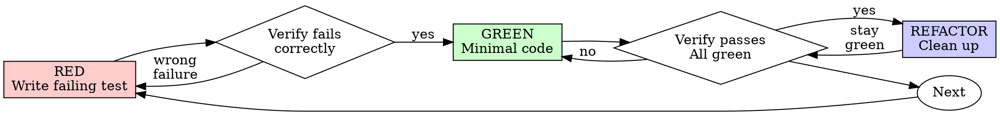

# executor

> 中文备注：本 skill 整合 superpowers `test-driven-development`（TDD 五步两门）+ `executing-plans`
> （单任务约束 + STOP）+ `subagent-driven-development`（SDD 调度）+ cc-best 熔断（`fix_count≥3`）。
> 由 orchestrator STATE 4 调用。自动选择执行策略：Inline（≤2 tasks）或 SDD（≥3 tasks）。

## Strategy Selection（双模式路由）

```
入口：orchestrator STATE 4 调用

IF state.json.plan.total_tasks ≤ 2 OR state.json.execution_strategy == "inline"：
  execution_strategy = "inline"
  → 执行 Inline 模式
ELSE：
  execution_strategy = "sdd"
  → 执行 SDD 模式

置 state.json.execution.strategy = execution_strategy
```

---

## Inline 模式（≤ 2 tasks）

主控 session 内直接执行 TDD。

### Single-task loop

For each task:
1. Mark as in_progress（置 `state.json.execution.current_task_id` / `.phase = RED` / `.fix_count = 0`）
2. Follow each step exactly (plan has bite-sized steps)
3. Run verifications as specified
4. Mark as completed

- **exactly** + **as specified** are the two anti-drift anchors: don't invent steps, don't skip plan-specified verifications.
- One task at a time. Complete and verify before moving to next.

### TDD Red-Green-Refactor

TDD 纪律详情参见 `workflow-plugin/prompts/tdd-reference.md`（按需 Read）。核心铁律：

```
NO PRODUCTION CODE WITHOUT A FAILING TEST FIRST
```

五步循环：RED → verify RED → GREEN → verify GREEN → REFACTOR

verify 使用 Gate Function（IDENTIFY/RUN/READ/VERIFY/CLAIM）：
1. IDENTIFY: What command proves this claim?
2. RUN: Execute the FULL command (fresh, complete)
3. READ: Full output, check exit code, count failures
4. VERIFY: Does output confirm the claim?
5. ONLY THEN: Make the claim

### Non-code Exemption（非代码文件豁免）

当 task 的 `Files` 字段**全部为非代码文件**时（.md / .json / .yaml / .toml / .css / .env / 脚本权限修改）：
- 跳过 RED/GREEN 步骤
- 直接执行修改
- verify 阶段改为"确认文件正确写入 + 内容符合预期"（非 test suite）

**判定边界**：若 task 同时包含代码文件和非代码文件 → 代码部分仍严格 TDD，非代码部分豁免。

代码类修改（.ts/.js/.py/.go/.rs/.java/.kt/.swift 等）永远严格 TDD，无例外。

### When to Stop and Ask for Help

**STOP executing immediately when:**
- Hit a blocker (missing dependency, test fails, instruction unclear)
- Plan has critical gaps preventing starting
- You don't understand an instruction
- Verification fails repeatedly

**Ask for clarification rather than guessing. Don't force through blockers.**

---

## SDD 模式（≥ 3 tasks）

主控仅做调度，每 task 派 fresh subagent（隔离 context）。

### Per-task dispatch loop

```
FOR EACH task in plan（按依赖序）：
  1. 运行 `bash workflow-plugin/scripts/task-brief.sh <plan-path> <task-index>` 提取当前 task 文本
  2. Read `workflow-plugin/prompts/implementer-prompt.md`
  3. 构造 subagent prompt = implementer-prompt 模板 + task brief 填入 {TASK_BRIEF_PLACEHOLDER}
     + plan 的 Global Constraints 填入 {GLOBAL_CONSTRAINTS_PLACEHOLDER}
  4. Dispatch implementer subagent（使用 Task 工具）
  5. 收集 subagent 报告，解析 STATUS：
     - DONE → 进入 review 步骤
     - BLOCKED → fix_count++，若 ≥3 熔断回 PLANNING
     - NEEDS_CONTEXT → 主控补充信息（读取相关文件），重新构造 prompt，re-dispatch
  6. 运行 `bash workflow-plugin/scripts/review-package.sh` 生成 diff
  7. Read `workflow-plugin/prompts/task-reviewer-prompt.md`
  8. 构造 reviewer prompt = task-reviewer-prompt 模板 + task spec 填入 {TASK_SPEC_PLACEHOLDER}
     + diff 填入 {DIFF_PLACEHOLDER}
  9. Dispatch task-reviewer subagent（使用 Task 工具）
  10. 解析 reviewer VERDICT：
      - APPROVED → mark complete，current_task_index++，fix_count = 0
      - ISSUES(Critical/Important) → dispatch fix subagent → re-review（最多 2 轮）
      - 2 轮后仍有 Critical → 熔断回 PLANNING
  11. 更新 state.json：execution.current_task_id / .phase / .fix_count / .status
      plan.completed_task_indexes 追加
```

### Narration rule

Between tool calls, narrate at most one short line — the state.json and tool results carry the record.

---

## Fuse / circuit-breaker（两种模式通用）

Same task's verification failure escalates by `fix_count`:

| fix_count | Strategy |
| --- | --- |
| 1 | Normal fix |
| 2 | Review the previous failure cause, fix from a **different angle** (don't repeat) |
| 3 | 🛑 **Fuse trips**: stop this task, mark blocked, return to orchestrator STATE 3 (PLANNING) for re-review |

`fix_count` lives in `state.json.execution.fix_count`. Reset to 0 after each task completion.

## Stall 检测（防死循环）

- 连续 2 次同 task 同错误 → 缩小范围（隔离更小单元）
- 3 轮无新 task 完成 → 切策略或回 PLANNING
- 同类工具失败 3+ 次 → 停止重试，分析根因或置 STOP

## 完成即继续铁律

task 完成 → 更新 state → 立即取下一 task 执行。
**禁止** "任务完成，需要我继续吗？" / "当前状态如下…"（等待）。
只在确认点/熔断/STOP 时停。

## Interface with orchestrator（中文适配层）

- **入口**：orchestrator STATE 4 取 `plan.current_task_index` 对应 task，调用本 skill。
- **退出（正常）**：所有 task completed → 交还 orchestrator 进入 STATE 5（VERIFICATION）。
- **退出（熔断）**：置 `.status = blocked` + `stop_reason`，orchestrator 回退 STATE 3（PLANNING）。
- **state 更新**：每个 task 完成/失败时更新 `execution.*` + `plan.completed_task_indexes`。

> 中文备注：本 skill 下方为 superpowers 英文原 prompt 逐字（Red Flags / Rationalization / Checklist 经调优，逐字保留以发挥原能力）。原版含 TypeScript Good/Bad 示例代码，此处省略以控制长度，行为约束完整保留。
> 由 orchestrator STATE 4 对**单个 task** 调用；一个 task 完成后交还 orchestrator 取下一个。

## Single-task loop (from executing-plans)

For each task:
1. Mark as in_progress
2. Follow each step exactly (plan has bite-sized steps)
3. Run verifications as specified
4. Mark as completed

- **exactly** + **as specified** are the two anti-drift anchors: don't invent steps, don't skip plan-specified verifications.
- One task at a time. Complete and verify before returning to orchestrator for the next.

## When to Stop and Ask for Help (from executing-plans)

**STOP executing immediately when:**
- Hit a blocker (missing dependency, test fails, instruction unclear)
- Plan has critical gaps preventing starting
- You don't understand an instruction
- Verification fails repeatedly

**Ask for clarification rather than guessing.** **Don't force through blockers.**

## Remember (from executing-plans)

- Review plan critically first
- Follow plan steps exactly
- Don't skip verifications
- Reference skills when plan says to
- Stop when blocked, don't guess
- Never start implementation on main/master branch without explicit user consent

## The Iron Law (from test-driven-development)

```
NO PRODUCTION CODE WITHOUT A FAILING TEST FIRST
```

Write code before the test? Delete it. Start over.

**No exceptions:**
- Don't keep it as "reference"
- Don't "adapt" it while writing tests
- Don't look at it
- Delete means delete

Implement fresh from tests. Period.

**Violating the letter of the rules is violating the spirit of the rules.**

## Red-Green-Refactor (from test-driven-development)

> 五步中的 verify RED / verify GREEN 遵循 `skills/verifier/SKILL.md` 的 Gate Function
> （IDENTIFY/RUN/READ/VERIFY/CLAIM）——本 skill 在 task 内做**单点**验证，verifier 在 STATE 5 做**全量**验证。



### RED - Write Failing Test

Write one minimal test showing what should happen.

**Requirements:**
- One behavior
- Clear name
- Real code (no mocks unless unavoidable)

### Verify RED - Watch It Fail

**MANDATORY. Never skip.**

Confirm:
- Test fails (not errors)
- Failure message is expected
- Fails because feature missing (not typos)

**Test passes?** You're testing existing behavior. Fix test.
**Test errors?** Fix error, re-run until it fails correctly.

### GREEN - Minimal Code

Write simplest code to pass the test.
Don't add features, refactor other code, or "improve" beyond the test.

### Verify GREEN - Watch It Pass

**MANDATORY.**

Confirm:
- Test passes
- Other tests still pass
- Output pristine (no errors, warnings)

**Test fails?** Fix code, not test.
**Other tests fail?** Fix now.

### REFACTOR - Clean Up

After green only:
- Remove duplication
- Improve names
- Extract helpers

Keep tests green. Don't add behavior.

### Repeat

Next failing test for next feature. Task is complete when all acceptance-criteria tests are green.

## Fuse / circuit-breaker (from cc-best `iterate`, not superpowers)

Same task's GREEN verification failure escalates by `fix_count`:

| fix_count | Strategy |
| --- | --- |
| 1 | Normal fix |
| 2 | Review the previous failure cause, fix from a **different angle** (don't repeat) |
| 3 | 🛑 **Fuse trips**: stop this task, mark blocked, return to orchestrator STATE 3 (PLANNING) for re-review |

`fix_count` lives in `state.json.execution.fix_count`. Reset to 0 after each GREEN success.

## Common Rationalizations (from test-driven-development, verbatim)

| Excuse | Reality |
|--------|---------|
| "Too simple to test" | Simple code breaks. Test takes 30 seconds. |
| "I'll test after" | Tests passing immediately prove nothing. |
| "Tests after achieve same goals" | Tests-after = "what does this do?" Tests-first = "what should this do?" |
| "Already manually tested" | Ad-hoc ≠ systematic. No record, can't re-run. |
| "Deleting X hours is wasteful" | Sunk cost fallacy. Keeping unverified code is technical debt. |
| "Keep as reference, write tests first" | You'll adapt it. That's testing after. Delete means delete. |
| "Need to explore first" | Fine. Throw away exploration, start with TDD. |
| "Test hard = design unclear" | Listen to test. Hard to test = hard to use. |
| "TDD will slow me down" | TDD faster than debugging. Pragmatic = test-first. |
| "Manual test faster" | Manual doesn't prove edge cases. You'll re-test every change. |
| "Existing code has no tests" | You're improving it. Add tests for existing code. |

## Red Flags - STOP and Start Over (from test-driven-development, verbatim)

- Code before test
- Test after implementation
- Test passes immediately
- Can't explain why test failed
- Tests added "later"
- Rationalizing "just this once"
- "I already manually tested it"
- "Tests after achieve the same purpose"
- "It's about spirit not ritual"
- "Keep as reference" or "adapt existing code"
- "Already spent X hours, deleting is wasteful"
- "TDD is dogmatic, I'm being pragmatic"
- "This is different because..."

**All of these mean: Delete code. Start over with TDD.**

## Verification Checklist (from test-driven-development, verbatim)

Before marking work complete:

- [ ] Every new function/method has a test
- [ ] Watched each test fail before implementing
- [ ] Each test failed for expected reason (feature missing, not typo)
- [ ] Wrote minimal code to pass each test
- [ ] All tests pass
- [ ] Output pristine (no errors, warnings)
- [ ] Tests use real code (mocks only if unavoidable)
- [ ] Edge cases and errors covered

Can't check all boxes? You skipped TDD. Start over.

## Interface with orchestrator（中文适配层）

- **入口**：orchestrator STATE 4 取 `plan.current_task_index` 对应 task，置 `state.json.execution.current_task_id` / `.phase = RED` / `.fix_count = 0`。
- **退出**：task 所有验收测试 green → 置 `.status = passed`，交还 orchestrator 取下一个 task（完成即继续，禁止总结等待）。
  熔断 → 置 `.status = blocked` + `stop_reason`，orchestrator 回退 STATE 3（PLANNING）。
